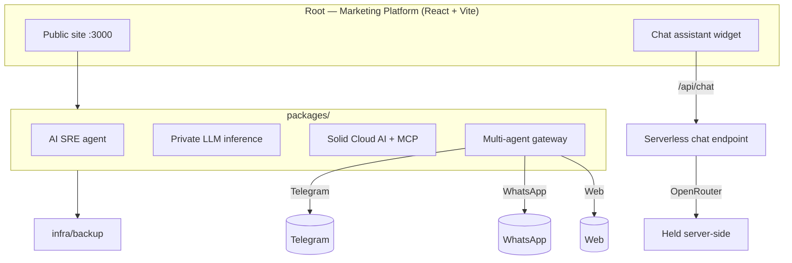

# SolidAI

Unified monorepo for the **SolidAI platform** — AI-powered enterprise solutions for African tech infrastructure, built by [Solid Solutions](https://solidsolutions.africa).

[](LICENSE)
[](package.json)
[](https://solidai.africa)

## Overview

SolidAI is a **monorepo** that consolidates the SolidAI marketing platform and its
product packages into a single codebase. It is the AI/cloud/LLM arm of Solid
Solutions, serving African SMEs with private LLM infrastructure, an SRE incident
agent, cloud AI tooling, and a multi-agent gateway.

## Features

- **Marketing platform** — React + Vite + Tailwind site with an embedded chat assistant.
- **AI SRE agent** (`packages/sre`) — incident investigation, config-service, and web UI.
- **Private LLM** (`packages/llm`) — training & inference (Python/FastAPI), OpenAI-compatible.
- **Solid Cloud AI** (`packages/cloud`) — backend, frontend, and MCP server.
- **Multi-agent gateway** (`packages/gateway`) — Telegram, WhatsApp, and web connectors.
- **Backup infra** (`infra/backup`) — scripts and Hermes sync helpers.

## Architecture



## Tech Stack

| Layer | Technology |
|-------|------------|
| Frontend | React 19, TypeScript, Vite 8, Tailwind CSS 4, Framer Motion |
| SRE / Config | Python (FastAPI), React (web_ui) |
| LLM | Python 3.12, FastAPI, transformers/torch (CPU-tested in CI) |
| Gateway | Node/TypeScript |
| Hosting | GitHub Pages (Vercel/cPanel for chat endpoint) |

## Installation

### Prerequisites

- Node.js 20+ and npm
- Python 3.12+ (for the Python packages)

### Platform (website)

```bash
npm install
npm run dev    # http://localhost:3000
npm run build  # output: dist/
```

### SRE Agent

```bash
cd packages/sre
cp .env.example .env
make dev       # http://localhost:3000
```

### LLM

```bash
cd packages/llm
python -m venv venv && source venv/bin/activate
pip install -r requirements.txt
python inference/api_v2.py
```

### Cloud AI

```bash
cd packages/cloud/backend
python -m venv venv && source venv/bin/activate
pip install -r requirements.txt
python app.py
```

### Gateway

```bash
cd packages/gateway
npm install
cp .env.example .env   # create from template if needed
npm start              # http://localhost:18789
```

## Local Development

```bash
npm install
npm run dev          # marketing site, HMR on :3000
npm run lint:all     # root tsc + SRE web_ui + Cloud frontend typechecks
npm run build        # production build
```

## Deployment

- **Marketing site:** `.github/workflows/main.yml` builds (`vite build`) and deploys
  to **GitHub Pages** on every push to `main`.
- **LLM package:** `.github/workflows/llm-tests.yml` runs the Python test suite
  (light + full CPU-torch tiers) on changes to `packages/llm`.
- **Chat endpoint:** serverless `api/chat.ts` (Vercel) or `public/api/chat.php`
  (cPanel); the provider key lives in the host's environment, never client-side.

## Environment Variables

Copy `.env.example` to `.env`.

| Variable | Purpose |
|----------|---------|
| `OPENROUTER_API_KEY` | Provider key for the site assistant (server-side only) |
| `SOLID_LLM_MODEL` | Optional; OpenRouter model (default `meta-llama/llama-3.3-70b-instruct`) |
| `VITE_CHAT_ENDPOINT` | Build-time chat endpoint path (default `/api/chat`) |
| `VITE_SOLID_LLM_API` | Optional; base URL for the from-scratch LLM demo |
| `GEMINI_API_KEY` | Legacy AI Studio key (optional) |
| `APP_URL` | Hosting URL for self-referential links |

> Provider keys are **never** committed. `.env*` is gitignored.

## Folder Structure

```
solidai-platform/
├── src/               # Marketing platform source (React + Vite)
├── public/            # Static assets (+ api/chat.php server-side key holder)
├── api/               # Serverless chat endpoint
├── packages/
│   ├── sre/           # AI SRE agent (config service + web_ui)
│   ├── llm/           # Private LLM training & inference
│   ├── cloud/         # Solid Cloud AI (backend, frontend, MCP)
│   └── gateway/       # Multi-agent gateway (Telegram/WhatsApp/web)
├── infra/backup/      # Backup scripts + Hermes sync
├── .github/workflows/ # CI/CD (main.yml, llm-tests.yml)
└── .env.example
```

## Roadmap

- [ ] Add per-package CI coverage beyond the LLM + root site.
- [ ] Add OpenAPI docs for `packages/gateway` and `packages/cloud`.
- [ ] Containerize packages with Docker.
- [ ] Add end-to-end tests for the chat assistant.
- [ ] Establish release/versioning process across packages.

## Contributing

See [CONTRIBUTING.md](CONTRIBUTING.md) and our [Code of Conduct](CODE_OF_CONDUCT.md).
Report security issues via [SECURITY.md](SECURITY.md).

## Migration Note

Former SolidAI repositories (`solidai-sre`, `solid-llm`, `solid-cloud-backup`)
have been consolidated into this monorepo. Clone this repo for the full platform.

## Links

- Website: [solidai.africa](https://solidai.africa)
- Parent company: [Solid Solutions](https://solidsolutions.africa)
- GitHub: [YassinAliYassin/solidai-platform](https://github.com/YassinAliYassin/solidai-platform)

## License

[MIT](LICENSE) © Solid Solutions
